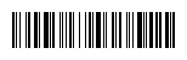

# Code128_Python

This is a simple Code128 1D barcode library for Python, working with the PIL library. The code can easily be reworked for other graphic libraries by changing the filled rectangle drawing code. That's the only part that relies on the PIL.

The library auto-detects whether it needs Code128B (uppercase and lowercase), C (only numbers), or A (uppercase). You pass it a string, the thickness of each module in pixels, and the height of the bars. It does the rest.

```python
myText = "Kongduino"
img = newCode128(myText, 60, 2)
img.show()
```



*Yes, I know I should make a class out of this code. But it's a simple demo. YOU do it.*